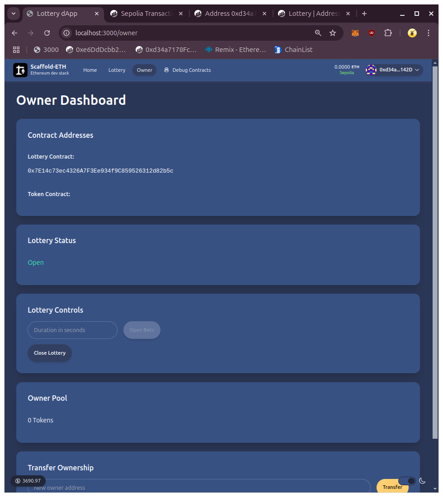
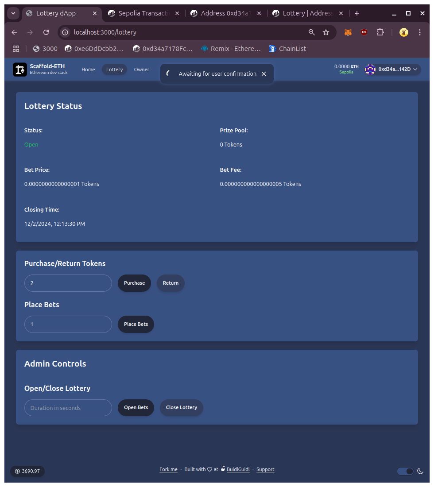

# Encode Solidity HW5

## Scope

* Build a frontend for the Lottery dApp 
  * Use any framework of your preference

* Implement the blockchain integration in the frontend 
* Buy/Return tokens
* View/Place bets 
* Run lottery 
* Check lottery state 
* View/Claim prizes 
* Lottery admin 
* Bonus: Organize, document and optimize the smart contract

## Notes 

* I have used Scaffold ETH 2 as the framework of choice.
* Landing page is at `/`\
* Lottery owner page is at `/owner`\ and locked unless signed in as the owner\
* Lottery page for users is at `/lottery`\ with all features implemented
* Have reorganized the smart contracts a bit:
  * Made a new function `areBetsOpen` that makes the function modifiers consistent with the variable naming as discussed [here](https://github.com/Encode-Club-Solidity-Bootcamp/Lesson-20/issues/29).

## Addresses on Sepolia
Lottery Token: https://sepolia.etherscan.io/address/0x84efEAdc1c71FFAB9Cc243a478bB53e43D29C308
Lottery: https://sepolia.etherscan.io/address/0x7e14c73ec4326a7f3ee934f9c859526312d82b5c
